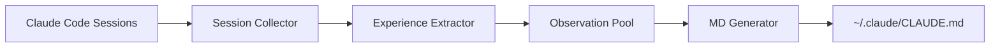

# claude-evolution

> 让 Claude Code 从历史会话中自我进化，持续优化您的工作流程

[](https://opensource.org/licenses/MIT)
[](https://nodejs.org/)
[](./coverage/index.html)
[](https://github.com/Xinbaiyu/claude-evolution)
[](https://github.com/Xinbaiyu/claude-evolution/pulls)
[](https://github.com/Xinbaiyu/claude-evolution/issues)

**claude-evolution** 是一个自进化系统，通过分析 Claude Code 的历史会话，自动学习您的工作偏好和问题解决模式，并生成优化建议来持续改进您的 CLAUDE.md 配置文件。

**🎯 [查看详细分析流程说明](./ANALYSIS_FLOW.md)** - 了解系统如何工作、核心价值和真实使用场景

---

## 🚀 快速开始

### 前置条件

- **Node.js** >= 18
- **Claude Code** 已安装并使用过
- **claude-mem Worker Service** (用于存储会话数据) ⭐ **必需**
  - **推荐安装**: 在 Claude Code 中执行 `/plugin install claude-mem`
  - **验证运行**: `curl http://localhost:37777/api/health`
- **ANTHROPIC_API_KEY** 环境变量（用于 LLM 分析）

### 安装

```bash
# 全局安装
npm install -g claude-evolution

# 或从源码构建
git clone https://github.com/Xinbaiyu/claude-evolution.git
cd claude-evolution
npm install
npm run build
npm link
```

### 初始化

```bash
# 运行初始化向导
claude-evolution init
```

初始化流程分为三个配置层级：

**P0 配置（必选）**:
- LLM Provider 选择:
  - [1] Claude Official API (推荐) - 需要 ANTHROPIC_API_KEY
  - [2] OpenAI-Compatible API - 支持 OpenAI/DeepSeek/Qwen/Azure
  - [3] CCR Proxy - 通过 claude-code-router 连接

**P1 配置（可选，有默认值）**:
- 调度频率: 24h / 12h / 6h (推荐) / 定时模式
- Web UI 端口: 默认 10010

**P2 配置（在 Web UI 中设置）**:
- Model 和 Temperature 调优
- 学习容量和算法参数
- 提醒系统 (桌面通知/Webhook)
- 机器人集成 (钉钉/Claude Code)
- 访问 http://localhost:10010/settings 进行配置

### 启动服务

```bash
# 启动守护进程
claude-evolution start

# 查看运行状态
claude-evolution status

# 访问 Web UI
open http://localhost:10010
```

---

## 🏗️ 系统架构

### 自动分析流程



### 核心组件

**Session Collector** (会话收集器)
- 通过 claude-mem HTTP API 获取会话数据
- 提取 Observation 记录（feature、bugfix、refactor、decision、discovery 类型）
- 支持时间范围过滤和敏感数据过滤

**Experience Extractor** (经验提取器)
- 使用 LLM 进行语义理解和知识提取
- 提取工作偏好、问题解决模式和工作流程
- 支持多种 LLM 提供商 (Claude/OpenAI/CCR)

**Observation Pool** (观察池)
- 三层存储架构:
  - **Active Pool** (候选池): 待验证的观察
  - **Context Pool** (上下文池): 高质量观察
  - **Archived Pool** (归档池): 已删除或过期的观察
- 支持时间衰减和自动提升机制

**MD Generator** (配置生成器)
- 合并 `source/` (静态规则) 和 Context Pool (学习内容)
- 生成最终的 `~/.claude/CLAUDE.md` 配置文件
- 支持文件监听和自动重新生成

---

## 📚 详细文档

完整文档请查阅 `docs/` 目录:

- **[CLI 命令参考](./docs/CLI_REFERENCE.md)** - 所有 CLI 命令的完整说明
- **[Web UI 使用指南](./docs/WEB_UI_GUIDE.md)** - Dashboard、Review、Settings 等页面介绍
- **[配置选项](./docs/CONFIGURATION.md)** - LLM、调度器、学习系统等详细配置
- **[故障排查](./docs/TROUBLESHOOTING.md)** - 常见问题和解决方案
- **[开发指南](./docs/DEVELOPMENT.md)** - 本地开发、测试和贡献指南

---

## 🤝 贡献指南

欢迎所有形式的贡献！您可以通过以下方式参与：

### 提交 Issue

遇到问题或有新想法？欢迎[提交 Issue](https://github.com/Xinbaiyu/claude-evolution/issues/new)：

- 🐛 **Bug 报告**: 描述问题、复现步骤、环境信息
- 💡 **功能建议**: 说明需求场景和预期效果
- 📚 **文档改进**: 指出不清楚或错误的文档
- ❓ **使用问题**: 寻求帮助和讨论

### 提交 Pull Request

1. Fork 本仓库
2. 创建您的特性分支 (`git checkout -b feature/AmazingFeature`)
3. 提交您的更改 (`git commit -m 'feat: add some amazing feature'`)
4. 推送到分支 (`git push origin feature/AmazingFeature`)
5. 提交 Pull Request

**贡献前请确保**:
- 代码风格符合项目规范
- 添加了必要的测试用例
- 更新了相关文档
- 提交信息遵循 [Conventional Commits](https://www.conventionalcommits.org/)

详细开发指南请参考 [DEVELOPMENT.md](./docs/DEVELOPMENT.md)

### 代码仓库

- **GitHub**: https://github.com/Xinbaiyu/claude-evolution
- **Issues**: https://github.com/Xinbaiyu/claude-evolution/issues
- **Pull Requests**: https://github.com/Xinbaiyu/claude-evolution/pulls

---

## 📄 许可证

MIT License © 2026

---

**Built with ❤️ using Claude Code**
