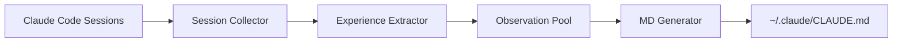

## Context

当前 README.md 采用"全面覆盖"策略，包含项目的所有细节（CLI、Web UI、开发、测试、故障排查等），适合深度用户但对新用户不友好。用户需要滚动 10+ 屏才能找到初始化流程。

**当前结构**（1000+ 行）：
```
- 核心特性 (200 行)
- 界面预览 (150 行)
- 快速开始 (100 行)
- 使用指南 (200 行)
- 目录结构 (100 行)
- 系统架构 (50 行)
- 数据模型 (100 行)
- 配置选项 (100 行)
- CLI 命令参考 (200 行)
- 开发指南 (100 行)
- 测试覆盖 (50 行)
- 故障排查 (100 行)
- 安全与隐私 (50 行)
- 路线图 (50 行)
- 贡献指南 (50 行)
```

## Goals / Non-Goals

**Goals:**
1. ✅ 新用户在 **2 分钟内**理解项目核心价值
2. ✅ 新用户在 **5 分钟内**完成项目初始化
3. ✅ 清晰展示自动分析架构设计
4. ✅ 减少 README 认知负担（约 70% 内容精简）

**Non-Goals:**
- ❌ 不删除详细文档（迁移到 docs/ 目录）
- ❌ 不影响现有用户查阅完整文档的能力
- ❌ 不改变项目功能或行为

## Decisions

### Decision 1: README 新结构（4 个核心章节）

**选择方案**: 精简结构（200-300 行）
```markdown
# claude-evolution
> 一句话介绍 + badges

## 🚀 快速开始
### 前置条件
- Node.js >= 18
- Claude Code 已安装
- claude-mem Worker Service
- ANTHROPIC_API_KEY

### 安装与初始化
1. 安装: npm install -g claude-evolution
2. 初始化: claude-evolution init
   - P0 配置（必选）: LLM Provider 选择
   - P1 配置（可选）: 调度器 + 端口
   - P2 配置（WebUI）: 在 http://localhost:10010/settings 配置高级选项
3. 启动: claude-evolution start

## 🏗️ 系统架构
### 自动分析流程
[架构图: 会话收集 → LLM 分析 → Observation Pool → CLAUDE.md]

### 核心组件
- Session Collector: 扫描 ~/.claude/projects/
- Experience Extractor: LLM 驱动的知识提取
- Observation Pool: 三层存储（Active/Context/Archived）
- MD Generator: 合并 source/ + learned/ 生成最终配置

## 📚 详细文档
完整文档请查阅 docs/ 目录：
- CLI 命令参考: docs/CLI_REFERENCE.md
- Web UI 使用指南: docs/WEB_UI_GUIDE.md
- 配置选项: docs/CONFIGURATION.md
- 故障排查: docs/TROUBLESHOOTING.md
- 开发指南: docs/DEVELOPMENT.md
```

**理由**:
- 遵循"快速入门优先"原则
- 架构图提供高层次理解
- 通过 docs/ 引导保留完整文档访问能力

**备选方案（已拒绝）**:
- 方案 A: 保持现有结构，仅删减细节 → 仍然过长
- 方案 B: 完全删除所有文档，仅保留一句话 → 信息不足

### Decision 2: 架构图设计

**选择方案**: 使用 Mermaid 流程图展示数据流



**理由**:
- Mermaid 图在 GitHub 上原生渲染
- 清晰展示 5 个核心组件的数据流
- 用户可快速理解自动分析流程

**备选方案（已拒绝）**:
- 纯文本描述 → 不够直观
- ASCII 艺术图 → 在移动端显示不佳
- 外部图片 → 需要维护图片文件

### Decision 3: 文档迁移策略

**选择方案**: 渐进式迁移（本次 PR 仅精简 README）

**阶段 1**（本 PR）:
- 精简 README 到 4 个核心章节
- 在 README 添加 docs/ 引导

**阶段 2**（后续 PR）:
- 创建 docs/CLI_REFERENCE.md
- 创建 docs/WEB_UI_GUIDE.md
- 创建 docs/CONFIGURATION.md
- 创建 docs/TROUBLESHOOTING.md
- 更新 README 中的 docs/ 链接

**理由**:
- 避免单个 PR 过于庞大
- 允许先验证精简后的 README 效果
- 文档迁移可以逐步完善

**备选方案（已拒绝）**:
- 一次性迁移所有文档 → PR 过大，难以审查
- 删除文档不迁移 → 丢失有价值的内容

## Risks / Trade-offs

### Risk 1: 用户找不到删除的内容
**风险**: 习惯查看 README 完整文档的用户可能不知道内容迁移到 docs/

**缓解措施**:
- 在 README 顶部添加醒目的 docs/ 引导
- 在每个章节末尾添加"详见 docs/XXX"链接
- 在 CHANGELOG 中明确说明文档重组

### Risk 2: 架构图过于简化
**风险**: 精简的架构图可能无法展示所有细节（如 Prompt Caching、时间衰减等）

**缓解措施**:
- 在架构图下方添加"核心组件"文字说明
- 在 docs/ARCHITECTURE.md 保留完整架构文档
- 架构图聚焦于数据流，不展示算法细节

### Risk 3: Init 流程说明不够详细
**风险**: 精简后的 Init 流程可能缺少某些关键信息（如 API Key 配置）

**缓解措施**:
- 保留 P0/P1/P2 分层说明
- 明确指出 P2 配置在 WebUI 中完成
- 在前置条件中强调 ANTHROPIC_API_KEY

## Migration Plan

### Phase 1: README 精简（本 PR）
1. 创建备份: `cp README.md README.md.backup`
2. 实现新结构（4 个核心章节）
3. 添加 docs/ 引导链接
4. 测试 Mermaid 图渲染
5. 更新 CHANGELOG

### Phase 2: 文档迁移（后续 PR）
1. 从备份中提取被删除的章节
2. 创建对应的 docs/ 文件
3. 更新 README 中的 docs/ 链接
4. 删除备份文件

### Rollback Strategy
如果精简后的 README 收到负面反馈:
1. 恢复备份: `cp README.md.backup README.md`
2. 调整结构但不完全删除内容
3. 重新评估精简程度

## Open Questions

1. **Mermaid 图样式**: 是否需要自定义颜色/样式?
   - 建议: 先使用默认样式，后续根据反馈调整

2. **前置条件章节**: 是否需要包含 claude-mem 的安装步骤?
   - 建议: 包含简要说明 + 链接到 claude-mem 文档

3. **Badges 选择**: 保留哪些 badges（License/Node/TypeScript/Coverage）?
   - 建议: 仅保留 License + Node + Coverage
